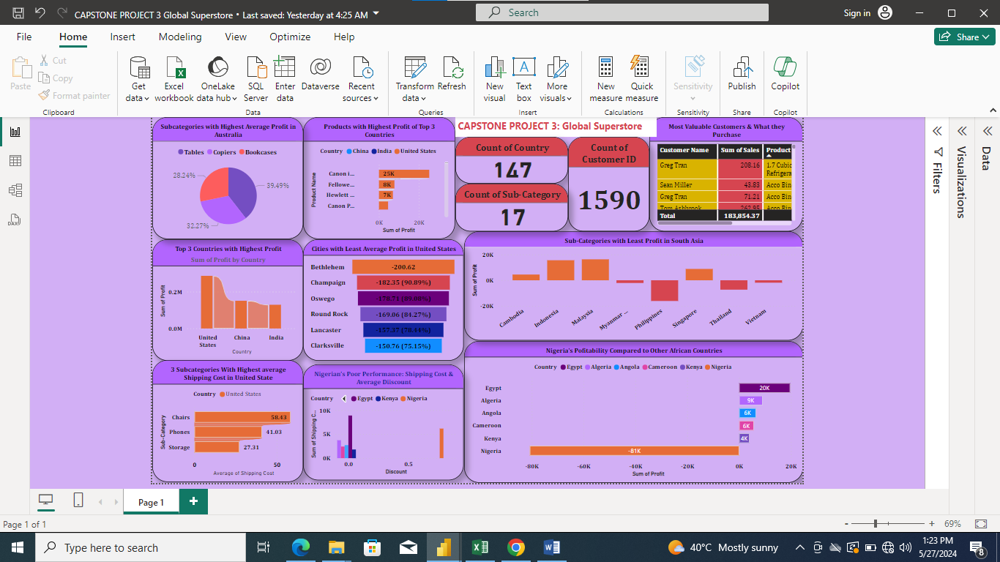

### Global-Superstore Anlysis
---

---
### Introduction
This is a Power BI project on **Global Superstore**. 
Global Superstore is a global online retailer based in New York, boasting a broad product catalog and aiming to be a one-stop-shop for its customers. Global The superstore’s clientele, hailing from 147 different countries, can browse through an endless offering with more than 10,000 products. This large selection comprises three main categories: office supplies (e.g., staples), furniture (e.g., chairs), and technology (e.g., smartphones).

### Problem Statement
1. _Question 1._
a) What are the three countries that generated the highest total profit for Global Superstore in 2014?
b) For each of these three countries, find the three products with the highest total profit. Specifically, what are the products’ names and the total profit for each product?
2. _Question 2._
a) Identify the 3 subcategories with the highest average shipping cost in the United States.
3. _Question 3._
a) Assess Nigeria’s profitability (i.e., total profit) for 2014. How does it compare to other African countries?
b) What factors might be responsible for Nigeria’s poor performance? You might want to investigate shipping costs and the average discount as potential root causes.
4. _Question 4._
a) Identify the product subcategory that is the least profitable in Southeast Asia.
Note: For this question, assume that Southeast Asia comprises Cambodia, Indonesia, Malaysia, Myanmar (Burma), the Philippines, Singapore, Thailand, and Vietnam.
b) Is there a specific country i n Southeast Asia where Global Superstore should stop offering the subcategory identified in 4a?
5. _Question 5._
a) Which city is the least profitable (in terms of average profit) in the United States? For this analysis, discard the cities with less than 10 Orders. 
b) Why is this city’s average profit so low?
6. _Question 6._
a) Which product subcategory has the highest average profit in Australia?
7. _Question 7._
a)Who are the most valuable customers and what do they purchase?
## Skills/concepts demonstrated:
● Power Query
● Data Modeling
● Data Cleaning
● Data Visualization
● Knowledge of generating actionable insights Etc.
## Modlling
Automtically derived relationships are adjused to remove and replace unwanted relationship with required.
Adjusted model                    |      Auto model
:--------------------------------:|:-------------------------:
                                        

## visualization
The report comparises 4 pages:
e.g
1. Countries with highest profit
2. Nigeria's profitablity compared to other African countries
3. Most valuable customers with products they purchase
4. Subcategories with  highest average shipping cost in US
You can interact with report [here] (link to power BI Service)

## Features

## Analysis
Customer history: [image]
The store currently has a total of ---  customers
-- orders were maade in current year.

## Product Cataloq: [image]
There -- products in the stores with worth of -- millions doolars
Each product costs more than 1k dollars on average.

## Transaction History: [image]
Total selling price is -- million.
The highest gross income was generated in july.
There is an intermitted rise and fall in the gross income of the store by every other month in the current year.

## Warehouse: [Image]

### Conclusion and Recommendations:
- United State has the highest profit
- There are -- products in the store with total worth of -- million
Recommendation: For deep dive into the analytics, the dataset of the previous years will be required for comparison and data driven decision making. 

